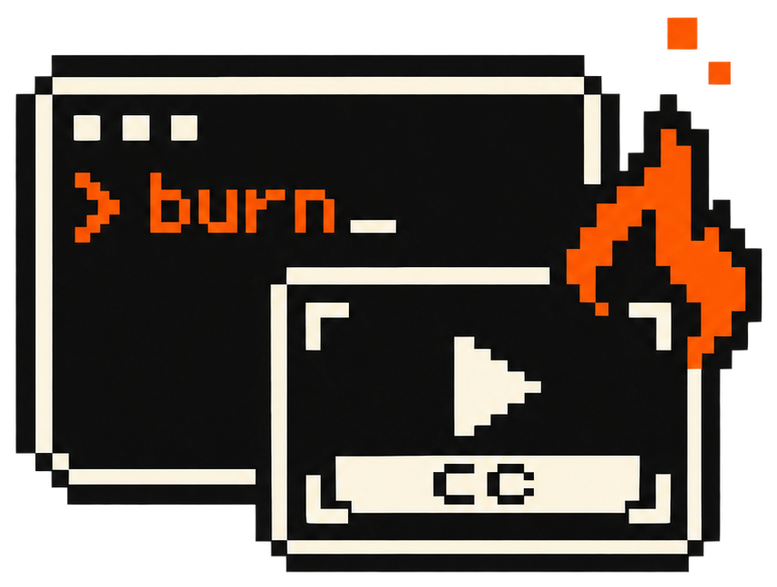
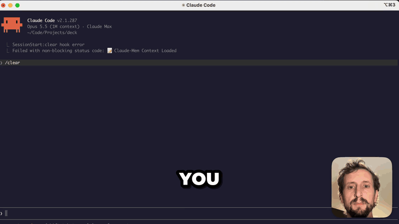
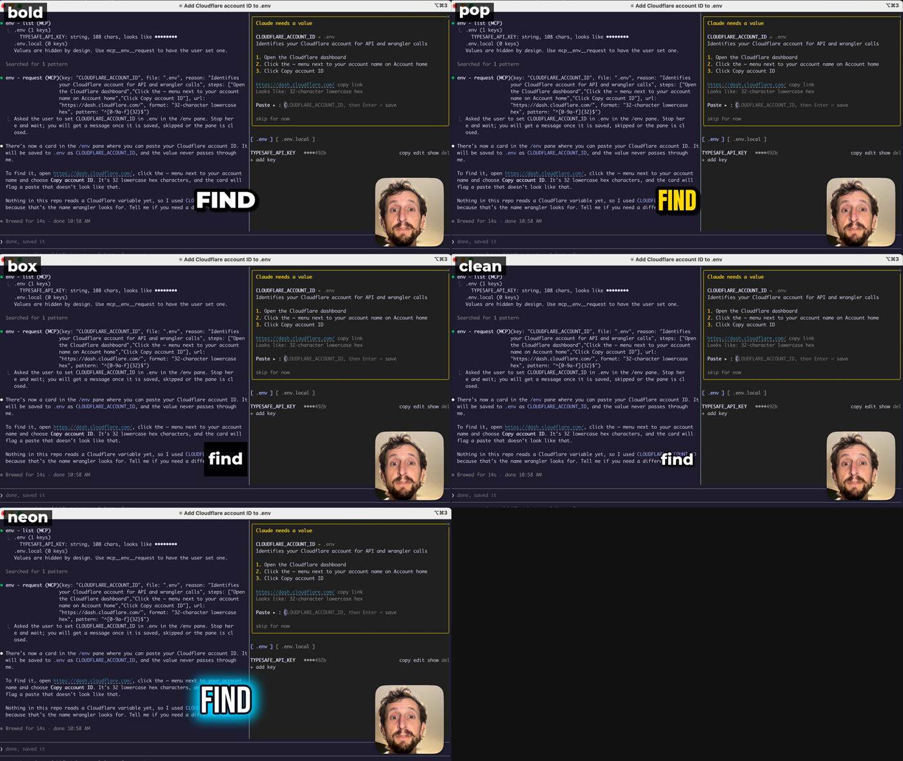

<p align="center">
  
</p>

<h1 align="center">burn</h1>

<p align="center"><b>Your agent captions the video. You post it.</b></p>

<p align="center">
  A CLI that lets any coding agent burn one-word-at-a-time captions into a video.<br>
  Local transcription. A real proofread. It checks its own render before it says it's done.
</p>

<p align="center">
  
  
  
  <a href="LICENSE"></a>
</p>

<p align="center">
  
  <br>
  <sub>The first five seconds of a demo, captioned by Claude with <code>burn</code> in the <code>bold</code> style.</sub>
</p>

---

You recorded a two-minute demo and it's ready for social, except nobody watches with the sound on. So you drop it into a caption app, wait for the upload, and fix "cloud code" eleven times by hand. Then you find a "Thank you." at the end that you never said, export again, and scrub through to make sure the captions actually landed.

With burn, you say *"caption this for social."* Your agent transcribes it on your Mac, proofreads it like an editor, fixes the names it already knows you say, picks a style, renders, and looks at frames from the finished file to confirm every word showed up where it should.

You get back a video and a list of what changed.

## Get started

```sh
uv tool install git+https://github.com/davekiss/burn
burn skill install
```

That installs the `burn` command and a Claude Code skill that teaches Claude the workflow. Then ask Claude to caption a video.

You'll need [uv](https://docs.astral.sh/uv/) and `ffmpeg` built with libass (`brew install ffmpeg` has it). The first transcription downloads Whisper large-v3-turbo (about 1.6 GB). After that, two minutes of speech takes about 30 seconds.

## What it's good at

### One word at a time, the way people read on their phones

Each word pops in at the moment it's spoken and stays up until the next one, so nothing flickers between fast words. After a pause, the last word lingers briefly, then clears. Sizes scale off the short side of the frame, so the same style works on a 16:9 screen recording and a 9:16 vertical.

> *"Caption this for TikTok."* · *"Burn in captions, yellow, centered."* · *"Use the box style, the background's busy."*

### It proofreads like an editor, not a spellchecker

Whisper is good, but it hears "cloud code", lowercases your `i`s, and sometimes finishes a clip with a "Thank you." nobody said. `burn lint` finds the mechanical problems and hands back a single `burn fix` command for the safe ones:

```
AUTO (safe to apply):
  glossary-case              92   26.24s  'mux'                    glossary spells it 'Mux'   [--replace mux=>Mux]
  sentence-case             162   49.92s  'tells'                  sentence should start uppercase   [--set 162=Tells]
  mid-sentence-caps         257   75.78s  'You'                    capitalized mid-sentence   [--set 257=you]
  glossary-alias            293   85.98s  '.m'                     known mishearing of '.env'   [--replace .m=>.env]
  empty                     363  105.78s  '.'                      punctuation-only word   [--set 363=]
CHECK (use judgment / burn listen):
  low-confidence             10    4.56s  'Code.'                  confidence 0.33; try `burn listen`

apply all AUTO fixes:
  burn fix talk.words.json --replace 'mux=>Mux' --set '162=Tells' --set '257=you' --replace '.m=>.env' --set '363='
```

The judgment calls stay with the agent: stutters, near-miss spellings, and words Whisper wasn't sure of. Then the agent reads the whole transcript for the one thing lint can't catch, a real word that's the wrong word.

### It learns how you talk

Names and jargon you say a lot live in `~/.config/burn/glossary.txt`:

```
Claude Code <= cloud code
Cloudflare
Mux
.env <= .m
```

The glossary primes Whisper before it listens, corrects known mishearings right after, and powers lint's "did you mean" check. When the agent fixes a new name, it adds it with `burn glossary add`, so the next video gets it right on the first pass.

### It checks instead of guessing

When a word looks wrong but might not be, `burn listen VIDEO 16.5 18.2` re-transcribes just that span three ways (plain, glossary-primed and sampled) and prints them next to what's in the transcript. If every take agrees, the agent keeps the text and tells you, rather than inventing a "fix".

### It looks at its own work

Every render ends with `burn verify`. It checks that the output's length, audio and frame size match the source, then builds a 3×3 grid of frames from the finished file, each labeled with the word that should be on screen. The agent reads the grid before it says it's done. That also gives it a look at the footage itself, so it can flag a token sitting in a clipboard popup before you post it.

### Five styles, any tweak

<p align="center">
  
  <br>
  <sub>Made with <code>burn sheet VIDEO W.json -t 67.3</code>: every style at the same moment, so the agent (or you) can pick one.</sub>
</p>

| Style | Look |
| --- | --- |
| `bold` (default) | White Montserrat Black, heavy outline, quick grow-in |
| `pop` | Yellow Anton, outline, bouncy overshoot |
| `box` | White on a solid black box, for busy footage |
| `clean` | Mixed case, soft outline and shadow, gentle fade |
| `neon` | Bebas Neue with a cyan glow |

Override any key per render: `--opt color=#ff4d4d --opt size=0.12 --opt position=lower --opt uppercase=false`. `burn styles` lists every key. Drop more `.ttf` files in `src/burn/fonts/` and use them with `--opt font="Family Name"`.

## How an agent uses it

```sh
burn transcribe talk.mp4                         # → talk.words.json, glossary applied
burn lint talk.words.json                        # run the fix command it prints
burn show talk.words.json                        # read for meaning
burn fix talk.words.json --set "41-42=Claude Code" --done
burn glossary add "Claude Code <= cloud code"
burn render talk.mp4 talk.words.json --style pop # renders, then verifies
```

Every command prints the next one to run, and most take `--json`. Edits are explicit: `burn show --index` numbers every word, and one `burn fix` call applies a whole batch against those numbers.

| Command | Does |
| --- | --- |
| `transcribe VIDEO` | Whisper → `VIDEO.words.json` with word timings and confidence |
| `lint W.json` | AUTO and CHECK suggestions, plus one fix command |
| `show W.json [--index]` | Readable transcript; `⟨word⟩` marks low confidence |
| `fix W.json --set I[-J]=TEXT --replace FROM=>TO [--shift S] [--done]` | Batch edits; empty text deletes |
| `listen VIDEO START END` | Re-transcribe a span several ways |
| `glossary [list\|add\|path]` | Manage your vocabulary |
| `styles` | Presets and every overridable key |
| `sheet VIDEO W.json -t T` | All styles at one moment, tiled and labeled |
| `still VIDEO W.json -t T` | Single frames in one style |
| `render VIDEO W.json --style S` | Burn in. `--clip A:B` previews a range, `--fps 60` for 120fps recordings, `--encoder videotoolbox` for speed |
| `verify OUT.mp4` | Checks and a labeled frame grid (runs after every render) |

`render` also writes `OUT.ass`, a standard subtitle file you can bring into Premiere, DaVinci Resolve or anything else that reads ASS.

## Install in detail

### Claude Code

```sh
uv tool install git+https://github.com/davekiss/burn
burn skill install            # copies the skill to ~/.claude/skills/burn
```

### Codex, OpenCode and other agents

The CLI is the whole interface, so any agent with a shell can drive it. Codex and OpenCode read skills from `~/.agents/skills`:

```sh
burn skill install --dir ~/.agents/skills
```

Or point your agent at [AGENTS.md](AGENTS.md).

### Platforms

Transcription uses [mlx-whisper](https://github.com/ml-explore/mlx-examples/tree/main/whisper), so it needs an Apple Silicon Mac. Everything else (lint, fix, render, verify) runs anywhere `ffmpeg` with libass does, including Linux CI.

## Development

```sh
uv run pytest
uv tool install -e .          # `burn` on your PATH, tracking this checkout
burn skill install --link     # skill symlinked, so edits show up immediately
```

The render tests generate a synthetic video with ffmpeg, so there are no fixtures to download.

## License

MIT. Montserrat, Anton and Bebas Neue are bundled under the [SIL Open Font License](src/burn/fonts/).
